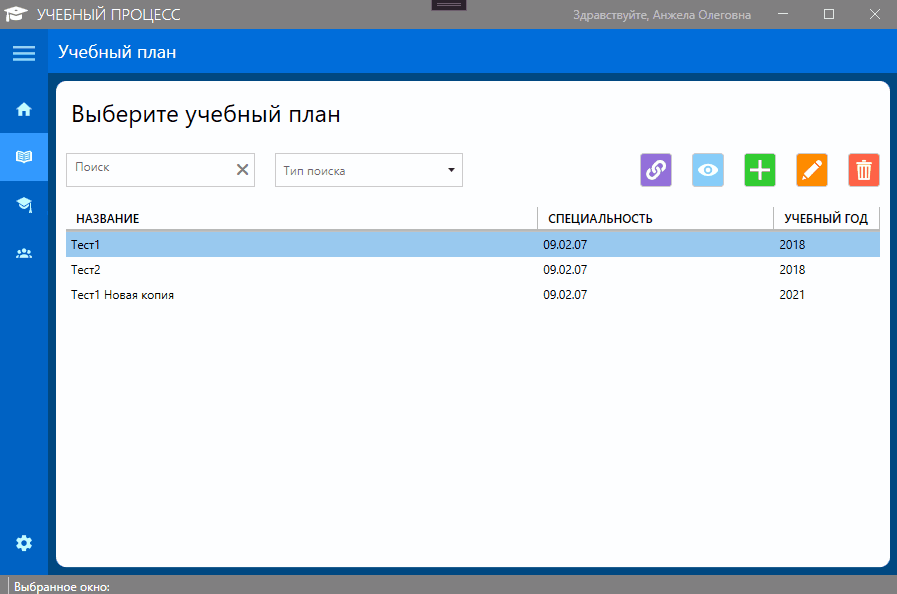

 

  

  <h2 align="center">WPF-приложение "Автоматизация учебного процесса" </h2>

# О проекте

__!!! Данный проект создавался исключительно в демонстрационных целях, дальнейшее его использование не предусмотрено.__

Поставленные задачи:
* Создать форму авторизации + функционал «Запомнить меня», три роли Преподаватель, руководитель УМО и сотрудник УМО
* Функционал Руководителя УМО
    1. Работа с учебным планом (в нем отображается количество часов общих по дисциплине, количество практических часов, лекционных и т.д.), добавление новых дисциплин, редактирование существующих, удаление, также должен быть поиск по дисциплине. Выгрузка итогового учебного плана в Excel
    2. Добавление дисциплины
    3. Редактирование дисциплины
    4. Дополнительно:
        * Помимо обычных дисциплин есть еще практика (учебная и производственная)
        * Есть возможность связать учебный план с группой (одной или несколькими)
        * После назначения группы появляется возможность прикрепить преподавателя к дисциплине. Одну и ту же дисциплину могут вести разные преподаватели в разных группах
* Функционал преподавателя
    1. Просмотр дисциплин (название, количество часов, группа), которые ему назначил руководитель УМО на следующий год, а также просмотр дисциплин за прошлый год.
        * Если ему назначают новую дисциплину, то появляются кнопки «Согласиться» и «Отказаться». Если преподаватель отказался от дисциплины, то у руководителя УМО должно это отобразиться. Отказаться от продолжающихся дисциплин, которые преподаватель вел в прошлом году нет возможности. То есть если дисциплина идет больше 1-го семестра, то от неё не отказаться
    2. Просмотр своего расписания на неделю.
* Функционал сотрудника УМО
    1. Должны отображаться преподаватели + дисциплина + количество часов на дисциплину.

    2. Используя эту информацию, пользователь составляет расписание на неделю у каждой группы.

    3. Внесение изменений в расписание в течении недели. Выгрузка в Excel

# Используемые технологии

* [NET 5](https://devblogs.microsoft.com/dotnet/introducing-net-5/)
* [WPF](https://docs.microsoft.com/ru-ru/dotnet/desktop/wpf/overview/?view=netdesktop-5.0)
* [Entity Framework Core](https://docs.microsoft.com/ru-ru/ef/core/)
* [DevExpressMvvm](https://github.com/DevExpress/DevExpress.Mvvm.Free)
* [SQL Server 2019](https://www.microsoft.com/ru-ru/sql-server/sql-server-2019)
* [MahApps.Metro](https://mahapps.com)

# Демонстрация

Здесь представлен пример того, как приложение будет использоваться:

## Меню авторизации

  
  <h4 align="center">Процесс входа в систему</h4>

 

## Руководитель УМО

### Добавление учебного плана

  
  <h4 align="center">Процесс добавления учебного плана с копированием данных из другого учебного плана</h4>

  
  <h4 align="center">Процесс добавления учебного плана без использования копирования данных другого учебного плана</h4>

   

### Редактирование учебного плана 

  

### Закрепление учебного плана за группой

  

### Выгрузка учебного плана в таблицу Excel

  

### Закрепление дисциплины за преподавателем

  

   

## Сотрудник УМО
### Процесс заполнения расписания

  

   

## Преподаватель
### Подтверждение дисциплин

  

### Подтверждение проведенного занятия

  

